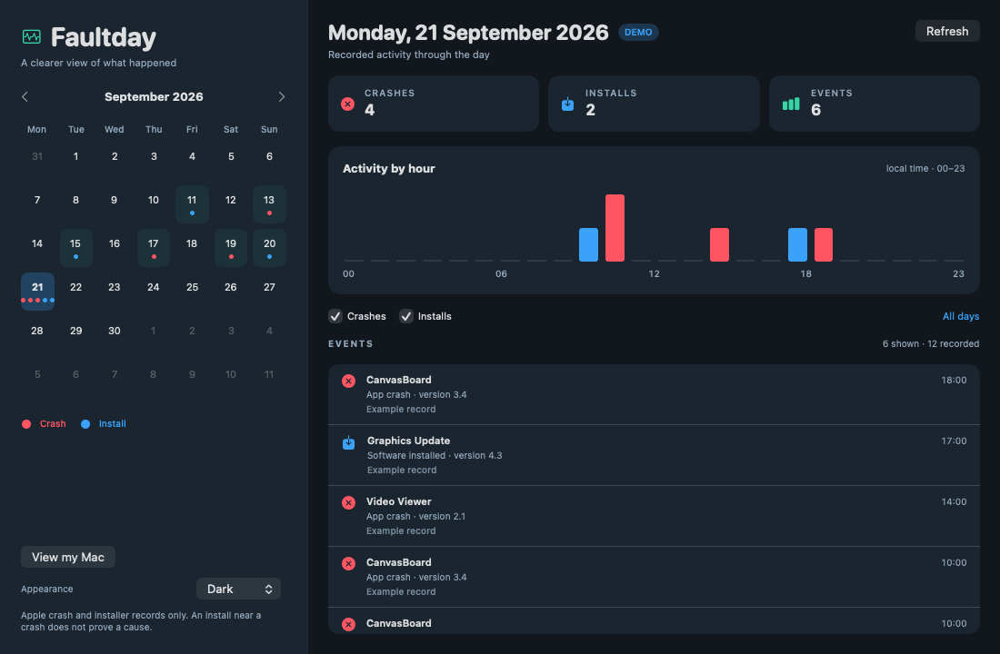

# Faultday

Faultday shows your Mac's crash reports and Apple installation history on a calendar. Pick a day to see which apps crashed and which software was installed around then.



## Install

Requires macOS 14 or later and Swift 5.9 or later to build from source.

```sh
git clone https://github.com/Morass/faultday.git
cd faultday
./Scripts/build-app.sh
cp -R build/Faultday.app /Applications/
```

Open **Faultday** from Applications. The app reads existing local records when it opens; use **Refresh** to read them again. It starts in dark mode; the **Appearance** menu also offers Light and System.

## Use

- Pick a date in the calendar to see its events and a 24-hour activity graph. Red marks are crashes; blue marks are installations.
- Click an hour in the graph to see only events from that hour. Click it again to clear the hour filter.
- Select **Try demo data** to explore a labelled example timeline without reading your records; **View my Mac** returns to your history.
- Use **Crashes** and **Installs** to filter the list.
- Choose **All days** to return to the full list. Use the month arrows to browse older records.
- An installation near a crash is a clue to investigate, not proof that the installation caused it.

Faultday reads crash reports in `~/Library/Logs/DiagnosticReports` and `/Library/Logs/DiagnosticReports`, plus `/Library/Receipts/InstallHistory.plist`. It does not modify those files, send data over the network, or stay running in the background after you quit.

## Limits

Apple's installation history omits many apps installed by other methods. Some system crash reports may require account permissions that your user does not have. Faultday currently shows app crash reports with Apple report type 309; it does not classify hangs, kernel panics, or unexpected restarts. Its history reaches back only as far as the records still on your Mac.

## License

MIT. See [LICENSE](LICENSE).
